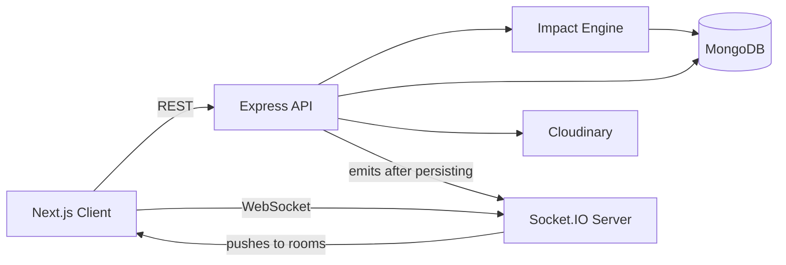
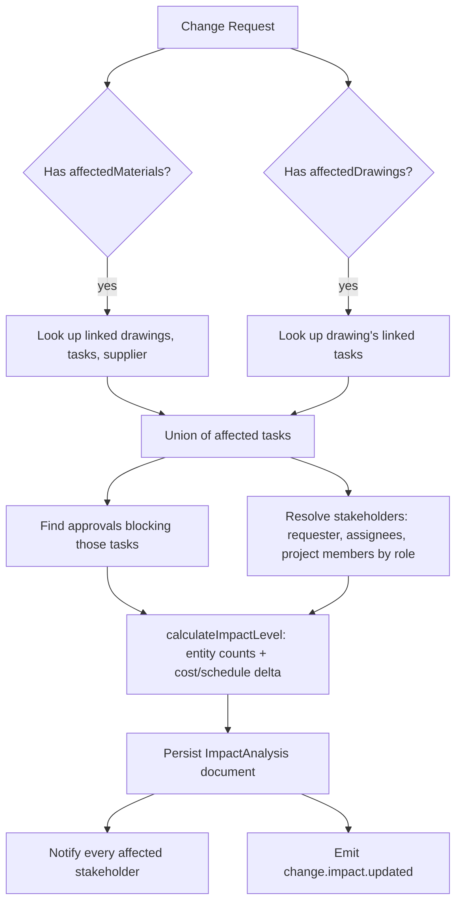
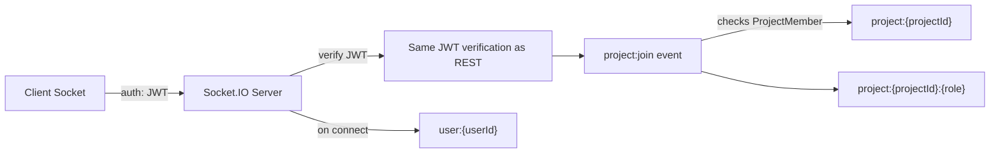
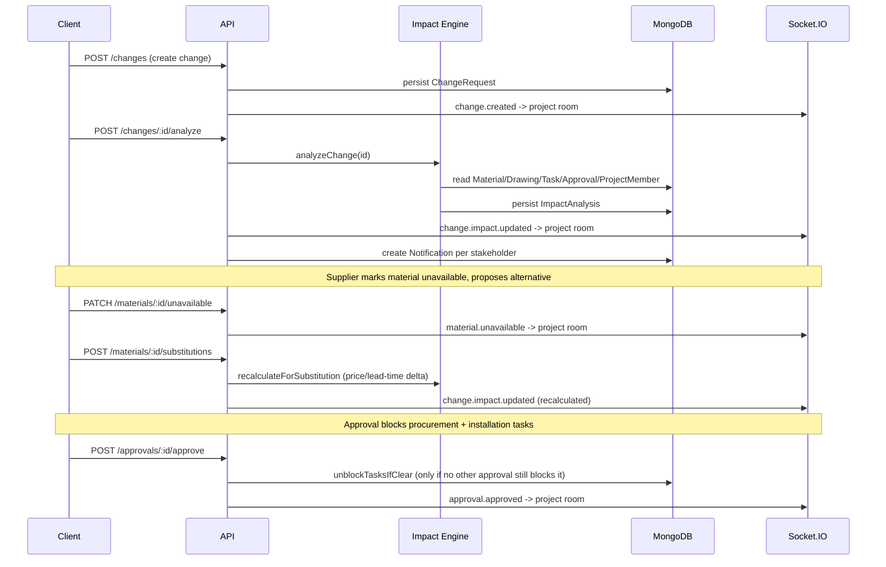

# Architecture

## System overview



**REST is the source of truth.** Every mutation goes: request → validate → persist to
MongoDB → *then* emit a Socket.IO event describing what changed. Socket.IO never
originates state; it only tells already-connected clients "go refetch, something changed."
This means a client that missed an event (page refresh, reconnect) is never out of sync --
the REST API always has the true current state.

## Request flow

```
Client
  ↓ REST request (with JWT)
Express (helmet, cors, rate limiter)
  ↓
authenticateUser (verifies JWT, loads req.user)
  ↓
authorizeRole (optional, per-route)
  ↓
checkProjectMembership (verifies req.user belongs to the target project)
  ↓
Controller (parses/validates body with Zod, calls services)
  ↓
Service (business logic -- Impact Engine, notification fan-out, approval unblocking)
  ↓
Model (Mongoose, talks to MongoDB)
  ↓
Controller emits a Socket.IO event to the relevant project/user room
  ↓
Response back to client
```

Business logic never lives in route files or controllers directly -- controllers parse
input and orchestrate; services own the actual rules (see `services/impact/impactEngineService.ts`,
`services/decision/approvalService.ts`, `services/notification/notificationService.ts`).

## The Impact Engine



The engine is entirely rule-based (see spec section 37's 12 rules) -- no AI, no ML model,
no probabilistic scoring. Given the same change request and the same underlying data, it
always produces the same result. This is a deliberate choice: teams need to *trust* an
impact report, and a black-box or non-deterministic score can't be audited or explained
to a client. See `docs/ai-usage.md` for where AI fits in instead.

## Socket.IO room model



- `user:{userId}` — joined automatically on connect. Used for personal notifications.
- `project:{projectId}` — joined only after the server verifies (via `ProjectMember`)
  that this user actually belongs to the project. A socket that isn't a member is
  silently not added to the room -- no error detail is leaked about the project's
  existence or membership to an unrelated user.
- `project:{projectId}:{role}` — a role-scoped room within the project, for role-specific
  broadcasts (e.g. only suppliers for a material-request event), joined at the same time.

## Data flow: hero workflow (spec section 3)



## Folder structure

See the root `README.md` for the top-level layout. Inside `apps/server/src`:

```
src/
├── app.ts            # Express app: middleware + route mounting
├── server.ts          # Entry point: connects DB, boots HTTP + Socket.IO
├── config/            # DB connection, Cloudinary config
├── models/             # Mongoose schemas
├── controllers/         # Parse request, call services, shape response
├── routes/              # Express routers, one per resource
├── middleware/           # auth, role, projectAccess, error
├── services/
│   ├── impact/           # The Impact Engine
│   ├── decision/          # Approval-unblock logic
│   └── notification/       # Notification fan-out + activity recording
├── socket/               # Socket.IO server + room logic
└── utils/                 # JWT helpers, AppError, seed script
```
